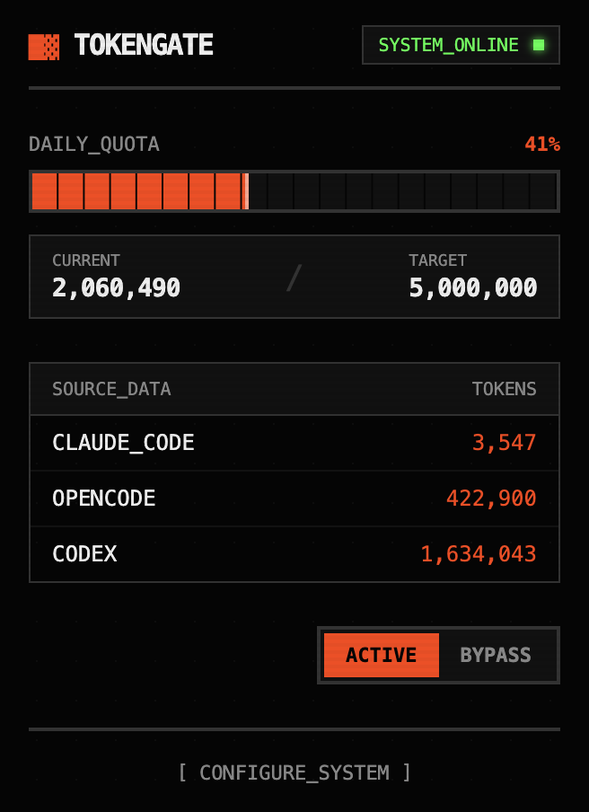
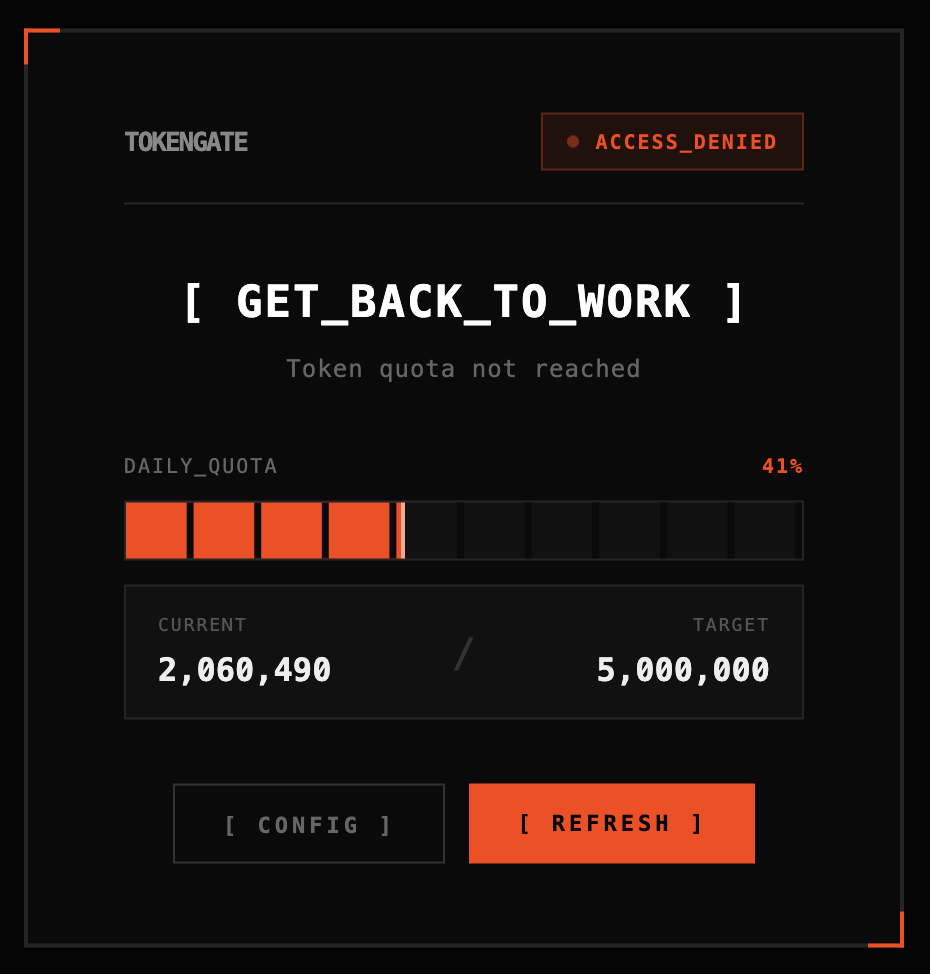
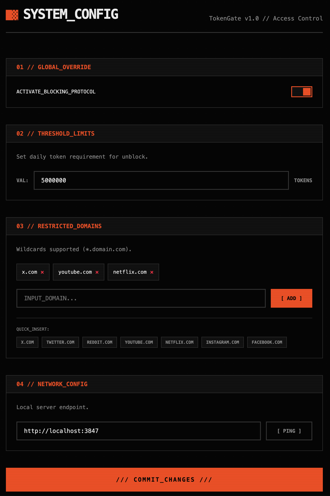

# TokenGate

> Block distracting websites until you've hit your daily AI coding token goals.

TokenGate is a productivity tool that helps you stay focused by blocking distracting websites until you've done meaningful work with AI coding tools like Claude Code, OpenCode, and Codex.

<p align="center">
  
  
</p>

<p align="center">
  
</p>

<p align="center">
  <em>TokenGate in action</em>
</p>

## How It Works

```
┌─────────────────────────────────────────────────────────────────┐
│                        Your Machine                              │
│                                                                  │
│  ┌─────────────┐   ┌─────────────┐   ┌─────────────┐            │
│  │ Claude Code │   │  OpenCode   │   │    Codex    │            │
│  └──────┬──────┘   └──────┬──────┘   └──────┬──────┘            │
│         │                 │                 │                    │
│         ▼                 ▼                 ▼                    │
│  ┌───────────────────────────────────────────────────────────┐  │
│  │                   tokengate-server                         │  │
│  │                   localhost:3847                           │  │
│  │                                                            │  │
│  │  Aggregates token usage from your AI coding tools          │  │
│  └───────────────────────────────────────────────────────────┘  │
│                              │                                   │
│                              ▼                                   │
│  ┌───────────────────────────────────────────────────────────┐  │
│  │                  tokengate-extension                       │  │
│  │                                                            │  │
│  │  Blocks distracting sites until you hit your token goal    │  │
│  └───────────────────────────────────────────────────────────┘  │
└─────────────────────────────────────────────────────────────────┘
```

## Quick Start

### 1. Install the Server

Works with **both Bun and Node.js** (18+):

```bash
# Using Bun (recommended)
bun add -g tokengate-server

# Using npm
npm install -g tokengate-server

# Or run without installing
bunx tokengate-server run
npx tokengate-server run
```

Then install as a background service:

```bash
tokengate-server install
```

The server runs on `http://localhost:3847` and will start automatically when you log in.

#### Server Commands

```bash
tokengate-server install    # Install and start as background service
tokengate-server uninstall  # Stop and remove service
tokengate-server start      # Start the service
tokengate-server stop       # Stop the service
tokengate-server status     # Check if running, show PID
tokengate-server run        # Run in foreground (for debugging)
```

### 2. Install the Extension

Download from Chrome Web Store (coming soon) or:

```bash
# Clone the repo
git clone https://github.com/0xqtpie/token-gate
cd token-gate
```

### Load unpacked in Chrome

1. Open Chrome and go to `chrome://extensions`
2. Enable "Developer mode" (toggle in top right)
3. Click "Load unpacked"
4. Select the `packages/extension` folder

### 3. Configure

1. Click the TokenGate extension icon
2. Go to Settings
3. Add domains you want to block (defaults are provided)
4. Set your daily token threshold
5. Start coding!

## Components

### tokengate-server

A local HTTP server that aggregates token usage from multiple AI coding tools:

- **Claude Code** - via `ccusage`
- **OpenCode** - via `opencode stats`
- **Codex** - via `@ccusage/codex`

[Server Documentation](./packages/server/README.md)

### tokengate-extension

A Chrome extension that:

- Blocks configured domains if you haven't hit your token goal
- Shows your progress with a clean overlay
- Provides quick access to your stats via popup

[Extension Documentation](./packages/extension/README.md)

## Development

```bash
# Clone the repo
git clone https://github.com/0xqtpie/token-gate
cd token-gate

# Install dependencies (Bun recommended, npm works too)
bun install    # or: npm install

# Start the server in dev mode
bun run dev    # or: npm run dev

# Load the extension in Chrome (see above)
```

## Configuration

### Server Options

| Option      | Default | Description                  |
| ----------- | ------- | ---------------------------- |
| `PORT`      | 3847    | Port to listen on            |
| `CACHE_TTL` | 30      | Seconds to cache usage data  |
| `ADAPTERS`  | all     | Comma-separated adapter list |

### Extension Settings

- **Blocked Domains** - Sites to block (supports wildcards like `*.reddit.com`)
- **Token Threshold** - Minimum tokens required to unblock (default: 50,000)
- **Server URL** - TokenGate server address (default: `http://localhost:3847`)

## Default Blocked Domains

The extension comes pre-configured to block common distracting sites:

- x.com / twitter.com
- reddit.com
- youtube.com
- netflix.com
- instagram.com
- facebook.com

## Design Decisions

- **No bypass** - There's no way to bypass the block. You must hit your token goal.
- **Offline behavior** - If the server isn't running, sites are blocked by default (with a warning shown)
- **24-hour period** - Token counting resets at midnight local time

## License

MIT
